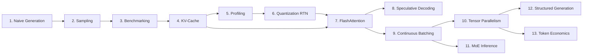

# Pumpference

**LLM inference from scratch in PyTorch** — focused on *learning-by-implementing*.

Build a real inference engine, optimization by optimization, until you understand what vLLM, llama.cpp, and TensorRT-LLM do internally.

### The Journey So Far

Starting from a naive 340-line PyTorch implementation and adding optimizations one at a time:

| Chapter | Optimization | CPU tok/s | vs Naive | Memory |
|---------|-------------|-----------|----------|--------|
| 1 | Naive generation | 0.2 | — | 3,223 MB |
| 4 | KV-cache | 12.0 | **60×** | +~114 MB (cache) |
| 6 | Int8 quantization | 3.7* | — | 2,629 MB |
| 6 | Int4 quantization | 1.8* | — | 2,348 MB |

*Dequantize-on-forward is slower than fp16 — [Chapter 6 explains why](tutorials/06-quantization.md). Fused kernels are next.

GPU baseline (KV-cached, bfloat16): **40 tok/s** on CUDA.

### Features

- Full Qwen3-0.6B architecture in plain PyTorch (~340 lines, one file)
- Greedy autoregressive generation verified token-for-token against HuggingFace `transformers`
- KV-cache: O(n) decode instead of O(n²), 9–46× CPU speedup depending on context length
- Sampling — temperature, top-k, top-p (nucleus), composable; `temperature=0` falls back to greedy
- Benchmark harness — prefill/decode TPS, TTFT, peak memory, per-token latency (p50/p90/p99)
- Profile harness — per-module coarse timing + `torch.profiler` operator breakdown
- Weight-only quantization — `Int8Linear` (W8A16) and `Int4Linear` (W4A16, group_size=128)
- CLI with device auto-detection (CUDA / MPS / CPU)

### Course Roadmap



| # | Title | Status |
|---|-------|--------|
| 1 | [Building an LLM Inference Engine From Scratch](tutorials/01-generation.md) | ✅ |
| 2 | [Sampling — Temperature, Top-k, and Nucleus Decoding](tutorials/02-sampling.md) | ✅ |
| 3 | [Benchmarking — Knowing What You're Measuring](tutorials/03-benchmarking.md) | ✅ |
| 4 | [KV-Cache: From O(n²) to O(n) Decode](tutorials/04-kv-cache.md) | ✅ |
| 5 | [Profiling: Where Does the Time Go?](tutorials/05-profiling.md) | ✅ |
| 6 | [Quantization: The Storage Win That Isn't a Speed Win (Yet)](tutorials/06-quantization.md) | ✅ |
| 7 | FlashAttention | 🔜 |
| 8 | Speculative Decoding | 🔜 |
| 9 | Continuous Batching + PagedAttention | 🔜 |
| 10 | Tensor Parallelism | 🔜 |
| 11 | MoE Inference | 🔜 |
| 12 | Structured Generation | 🔜 |
| 13 | Token Economics | 🔜 |
| 14 | Prefix Caching *(Advanced)* | 🔜 |
| 15 | Hardware Fundamentals *(Advanced)* | 🔜 |
| 16 | Multi-modal Inference *(Advanced)* | 🔜 |
| 17 | LoRA Inference *(Advanced)* | 🔜 |

### Reference baseline

This project re-implements **Qwen3** architecture from scratch:

- Raschka notebook: [`standalone-qwen3.ipynb`](https://github.com/rasbt/LLMs-from-scratch/blob/main/ch05/11_qwen3/standalone-qwen3.ipynb)
- Raschka blog: [Understanding and Implementing Qwen3 From Scratch](https://sebastianraschka.com/blog/2025/qwen3-from-scratch.html)
- Qwen3 report: [Qwen3 Technical Report](https://arxiv.org/abs/2505.09388)

### Quickstart

```bash
pipx install uv
git clone https://github.com/legchikov/pumpference.git
cd pumpference
uv venv
source .venv/bin/activate
uv pip install -U pip
```

Install PyTorch (CPU/CUDA) using the official selector: `https://pytorch.org/get-started/locally/`.

Then install the package:

```bash
uv pip install -e ".[dev]"
```

### Running inference

```bash
uv run python -m pumpference --prompt "Explain how transformers work"
uv run python -m pumpference --help   # all options
```

Downloads Qwen3-0.6B (~1.2 GB) on first run.

**Sampling flags:**

```bash
# Greedy (default)
uv run python -m pumpference --prompt "Tell me a joke"

# Temperature sampling
uv run python -m pumpference --prompt "Tell me a joke" --temperature 0.8

# Top-k + temperature
uv run python -m pumpference --prompt "Tell me a joke" --temperature 0.8 --top-k 50

# Nucleus (top-p) sampling
uv run python -m pumpference --prompt "Tell me a joke" --temperature 0.9 --top-p 0.95

# Quantized inference (int8 / int4)
uv run python -m pumpference --prompt "Tell me a joke" --quantize int8
```

### Benchmarking

```bash
make bench                   # default: xs preset (~30 prompt tokens)
make bench PRESET=short      # ~115 tokens
make bench PRESET=medium     # ~218 tokens
make bench PRESET=long       # ~373 tokens
make bench PRESET=xs QUANTIZE=int8   # quantized benchmark
```

Results are printed to stdout and saved as JSON under `benchmarks/`.

### Profiling

```bash
make profile                 # coarse per-layer timing + torch.profiler breakdown
make profile PRESET=short
```

### Running tests

```bash
uv run pytest
```

18 tests: compares against HuggingFace `transformers` for correctness (logits, KV-cache, generation), 17 unit tests for sampling (no model required), 11 tests for quantization correctness and memory reduction.

### Contributing

TBD
