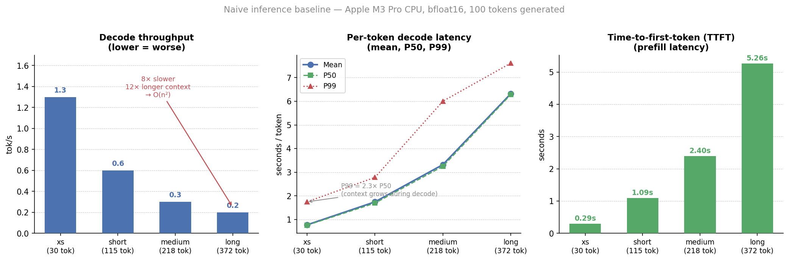
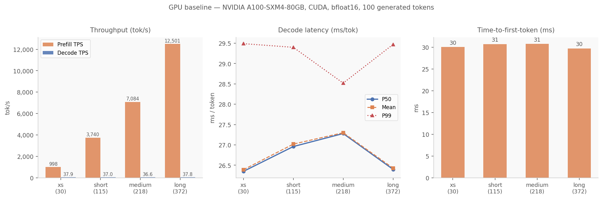

# Part 3: Benchmarking — Knowing What You're Measuring

*Pumpference series — from zero to a working inference framework in plain PyTorch*

---

Here's an uncomfortable thing to admit. In Tutorial 1, I wrote "about 1 tok/s on Apple M3 Pro CPU" as if that were a real measurement. It wasn't. I ran a few generation experiments, watched the seconds tick by on a couple of prompts, did rough mental arithmetic, and called it a number.

That number had no context. I didn't know whether the slowness was in prefill or decode. I hadn't separated time-to-first-token from per-token decode latency. I didn't record which version of the code produced it. I didn't warm up the model before timing. If I refactored the attention module and ran it again tomorrow, I'd have no idea whether it got better or worse — I'd just have another eyeballed number.

This is the wrong way to work, and it caught up with me when I started thinking about the KV-cache. The KV-cache (Tutorial 4) is the single biggest optimization available — it turns decode from O(n²) to O(1) per step. Before implementing it, I need to know, objectively and reproducibly, exactly what I'm starting from. I need a number that comes with a methodology. Something I can run twice and get the same result. Something that will change in a detectable way the moment the code changes.

"Slow" is not a number. Let's get actual numbers.

---

## What we're measuring

LLM inference has two fundamentally different phases:

**Prefill**: the model processes the full input prompt in a single forward pass. All tokens flow through the network in parallel. This is compute-intensive — a lot of FLOPS per byte of memory read. The cost grows roughly with the number of tokens, with attention contributing an O(n²) component even within a single parallel pass.

**Decode**: the model generates one token at a time. On each step, the growing sequence (prompt plus all tokens generated so far) gets fed through the full network, and only the last position's output matters. In our current implementation — no KV-cache — every decode step recomputes the keys and values for every previous token. Step 50 does the work of 50 steps. Step 100 does the work of 100. This is the O(n²) that makes our implementation essentially unusable for long contexts.

Prefill and decode are different regimes with different bottlenecks. Reporting a single "tokens per second" number that combines them is like reporting average speed for a road trip that includes a traffic jam — the number tells you almost nothing about either leg.

Beyond the prefill/decode split, the benchmark tracks:

- **TTFT (Time-to-First-Token)**: how long the user waits before seeing any output. Without KV-cache, TTFT equals prefill time — they're the same forward pass. With a KV-cache, prefill time could increase while per-token decode latency drops dramatically. Tracking TTFT separately forces you to think about the user-experience metric, not just throughput.

- **Decode latency distribution (p50/p99)**: a single mean latency hides the story. In our O(n²) implementation, each decode step is slower than the last — the context keeps growing. P50 captures the typical experience mid-generation; P99 captures the worst-case experience at the end. The gap between them is, itself, a measurement of how badly O(n²) is hurting us.

- **Peak memory**: model weights right now, plus KV-cache later. The whole point of the KV-cache is to spend more memory to save compute — we need to track both sides of that trade.

---

## Key decisions

**Warmup before timing.** The first forward pass of a PyTorch model is always slower than subsequent ones. On CPU, the model weights are memory-mapped from disk and only paged into RAM on first access — you're paying OS page fault overhead that you'll never pay again after the first pass. On CUDA, the first pass triggers JIT compilation of any remaining kernels. Without warmup, your "prefill time" measurement includes one-time initialization costs that have nothing to do with steady-state performance. The harness runs one untimed forward pass before any measurement begins.

**`_sync(device)` around every timed section.** On CUDA, PyTorch operations are asynchronous. When you call `model(tokens)`, it returns before the GPU has finished computing. If you immediately call `time.perf_counter()`, you're measuring how long it took to *enqueue* the work, not how long the work takes. The fix is `torch.cuda.synchronize()` before reading the clock. On CPU, nothing is async, so the helper is a no-op. The pattern is consistent throughout the harness: sync → start timer → do work → sync → stop timer.

**Named presets for prompt lengths.** The harness ships with four presets: `xs` (~30 tokens), `short` (~115), `medium` (~218), `long` (~372). These are verified against the Qwen3 tokenizer — the token counts are exact. This matters because our O(n²) decode cost means prompt length completely dominates performance. A 30-token prompt produces very different numbers than a 372-token prompt, not because of the prompts themselves but because of how the decode context grows. Running all four presets reveals the scaling law, not just a single data point on the curve.

**Per-step latency recording.** Instead of one aggregate decode time, the harness timestamps every individual decode step and stores a list of 99 latencies (for 100 generated tokens). That list goes into the p50/p90/p99 calculation. This is what makes the O(n²) behavior visible — the full distribution, not just the mean. Without per-step recording, you'd have one number and miss the entire story.

**JSON output with git commit hash.** Every run saves a result file to `benchmarks/`. The JSON includes the git commit, device, dtype, timestamp, and all measured values. This sounds like over-engineering until you have three benchmark results on a shared drive and no idea which version of the code produced each one. The commit hash is the paper trail. Run twice with no code changes: hashes match. Run after a change: they don't. You can always reconstruct which code produced which number.

**`resource.getrusage` for CPU memory.** CUDA has `torch.cuda.max_memory_allocated()` for exact GPU memory. CPU has no equivalent at the PyTorch level. We fall back to `ru_maxrss` — the peak resident set size from the OS. This measures total process memory, not just model weights, so it's an upper bound rather than an exact figure. But it's consistent across runs on the same machine, which is enough to see trends.

---

## The tricky parts

| Issue | Symptom | Fix |
|---|---|---|
| `ru_maxrss` unit differs by OS | Memory reads 1024× too low on Linux | `ru_maxrss` is **bytes** on macOS, **kilobytes** on Linux; check `platform.system()` |
| CUDA timing without synchronization | Prefill reports 0.3 ms for a 372-token prompt | `torch.cuda.synchronize()` before every `time.perf_counter()` call |
| Missing warmup | First run is 3–5× slower than subsequent runs | One untimed forward pass before the benchmark loop |
| p99 from 99 samples | Statistically fragile; one outlier dominates | Acknowledged limitation — 100 tokens gives 99 decode samples, enough to see growth but not to trust the exact p99 value |
| RSS includes Python runtime | "Peak memory" reads ~4 GB when weights are ~1.2 GB | Expected — RSS is the full process. On CUDA, `torch.cuda.max_memory_allocated()` gives a cleaner number |
| Latency distribution is skewed by design | P99 >> P50 even on a stable machine | Not measurement error — context grows on every step, so later decode steps are legitimately slower |

---

## The core timing structure

The key structural element in the harness is the prefill/decode split. Here's what it looks like:

```python
# Prefill: one forward pass over the full prompt
_sync(device)
t_prefill_start = time.perf_counter()

logits = model(tokens)
next_token = logits[:, -1].argmax(dim=-1, keepdim=True)
tokens = torch.cat([tokens, next_token], dim=1)

_sync(device)
prefill_time = time.perf_counter() - t_prefill_start

# Decode: one timed forward pass per new token
for _ in range(max_new_tokens - 1):
    _sync(device)
    t_step = time.perf_counter()

    logits = model(tokens)
    next_token = logits[:, -1].argmax(dim=-1, keepdim=True)
    tokens = torch.cat([tokens, next_token], dim=1)

    _sync(device)
    decode_step_latencies.append((time.perf_counter() - t_step) * 1000.0)
```

The per-step latency list is what reveals the growth pattern. With only a total decode time, you'd have one number. With per-step latencies, you have 99 numbers — and their distribution tells the O(n²) story more clearly than any summary statistic can.

Full implementation: [`src/pumpference/benchmark.py`](../src/pumpference/benchmark.py).

---

## The baseline numbers

Apple M3 Pro, CPU, bfloat16, 100 generated tokens per preset, one warmup run. Greedy decoding.

| Preset | Prompt tok | Prefill TPS | TTFT | Decode TPS | Mean latency | P50 | P99 | Peak memory |
|--------|:---:|---:|---:|---:|---:|---:|---:|---:|
| xs     |  30  | 102.1 tok/s |  294 ms | 1.3 tok/s |  777 ms/tok |  762 ms |  1750 ms | 4122 MB |
| short  | 115  | 105.2 tok/s | 1093 ms | 0.6 tok/s | 1749 ms/tok | 1696 ms |  2784 ms | 4013 MB |
| medium | 218  |  90.9 tok/s | 2398 ms | 0.3 tok/s | 3323 ms/tok | 3252 ms |  6003 ms | 3738 MB |
| long   | 372  |  70.7 tok/s | 5264 ms | 0.2 tok/s | 6321 ms/tok | 6284 ms |  7612 ms | 3783 MB |



Let me read what's actually in this table.

**Prefill scales slightly worse than linearly.** From 30 to 372 tokens (12.4×), TTFT goes from 294 ms to 5264 ms (17.9×). Not linear, not quadratic — somewhere between. Prefill processes all tokens in parallel, so the dominant cost is memory bandwidth and arithmetic throughput, not the O(n²) attention. The superlinear component comes from attention, which is quadratic even in a single pass, but it's fast enough at these sizes that it doesn't dominate.

**Decode is clearly O(n²).** This is the number that matters. Per-token decode latency goes from 777 ms at a 30-token context to 6321 ms at a 372-token context. That is an **8× slowdown for a 12× increase in context length**. That is the signature of quadratic scaling. Every decode step re-runs the full sequence through all 28 layers. Step 50 on the `long` preset processes ~422 tokens. Step 100 processes ~472. Each additional token in the context makes every future step proportionally more expensive. At 0.2 tok/s, this is unusable for anything interactive.

**The P99 spike on `xs` is the most revealing data point in the entire table.** P50 decode latency for `xs` is 762 ms. P99 is 1750 ms — a 2.3× spread within a single 100-token generation run. This is not noise. It's the O(n²) cost structure in plain sight, encoded in the latency distribution. The first decode step processes 31 tokens (fast). The last decode step processes 129 tokens (slow). The median step lands around 80 tokens. The distribution isn't a distribution — it's a slope.

For the `long` preset, that spread narrows (P50=6284 ms, P99=7612 ms, 1.2×). Why? Because all decode steps start from an already-large context. The proportional growth per additional step is smaller. The O(n²) slope is still there, but you're starting from high enough on the curve that the next hundred steps don't cover much relative range.

**Memory is ~4 GB everywhere.** Model weights are ~1.2 GB in bfloat16. The rest is PyTorch's allocator, Python runtime, and intermediate activation buffers. It barely varies with context length because we're not caching anything — activations are computed and freed on every forward pass. When we add a KV-cache, this number will increase. That's the explicit trade: more memory in exchange for dramatically faster decode.

---

## GPU baseline

NVIDIA A100-SXM4-80GB, CUDA, bfloat16, 100 generated tokens per preset, one warmup run. Greedy decoding.

| Preset | Prompt tok | Prefill TPS | TTFT | Decode TPS | Mean latency | P50 | P99 | Peak memory |
|--------|:---:|---:|---:|---:|---:|---:|---:|---:|
| xs     |  30  |    997.6 tok/s |  30 ms | 37.9 tok/s |  26.4 ms/tok |  26.4 ms |  29.5 ms | 3239 MB |
| short  | 115  |  3,739.7 tok/s |  31 ms | 37.0 tok/s |  27.0 ms/tok |  27.0 ms |  29.4 ms | 3540 MB |
| medium | 218  |  7,084.3 tok/s |  31 ms | 36.6 tok/s |  27.3 ms/tok |  27.3 ms |  28.5 ms | 3969 MB |
| long   | 372  | 12,500.7 tok/s |  30 ms | 37.8 tok/s |  26.4 ms/tok |  26.4 ms |  29.5 ms | 4708 MB |



**TTFT is flat.** 30–31 ms across all presets. On CPU, TTFT grew from 294 ms to 5264 ms — a 17.9× stretch. On GPU, it barely moves. The A100 processes all 372 prompt tokens in a single forward pass, and the full parallelism of the hardware absorbs the extra compute without the user noticing. This is the most striking single number in the table.

**Prefill TPS scales superlinearly.** From 30 to 372 tokens (12.4×), prefill throughput goes from 998 to 12,501 tok/s (12.5×). That might look linear, but the mechanism is different at each size. At 30 tokens, the GPU is largely idle — most tensor cores aren't doing useful work because the matrices are too small to saturate them. As the prompt grows, the computation becomes dense enough that the GPU's parallelism fully engages. The A100 is a machine built to eat large matrix multiplications; small batches starve it.

**The O(n²) signature is gone.** Decode TPS is 37.9 tok/s at 30 tokens and 37.8 tok/s at 372 tokens. The quadratic cost is not gone — every decode step still reprocesses the full growing sequence — but the GPU's FLOPS headroom is large enough that the O(n²) component doesn't show up within 100 steps at these context lengths. Per-step latency is a flat ~26 ms whether the context is 31 tokens or 471 tokens. The KV-cache will still matter (it removes the quadratic compute entirely), but the motivation on GPU is different: not survival, but efficiency and scalability to longer contexts.

**Decode latency is uniform across all presets.** P50 is 26–27 ms and P99 is 28–30 ms regardless of whether the context is 30 or 372 tokens. No preset shows a meaningful outlier. This confirms that the O(n²) compute growth is completely absorbed by the GPU's memory bandwidth and FLOPS headroom at these context lengths — the quadratic component simply isn't visible in 100 decode steps starting from sub-400-token contexts.

**Memory grows, as expected.** 3239 MB at 30 tokens, 4708 MB at 372 tokens. Model weights are ~1.2 GB. No KV-cache, so the allocator creates and frees activation buffers on every forward pass — but the peak allocation scales with sequence length because the attention weight matrices (n × n per layer) are larger at longer contexts. This growth is the cost of recomputation. The KV-cache trades it for a different kind of growth: stored KV tensors that accumulate linearly rather than the peak-and-free pattern here.

**How does it compare to CPU?** Decode throughput advantage grows with context: 29× faster at 30 tokens, 189× faster at 372 tokens. That widening gap is the O(n²) cost falling entirely on the CPU. TTFT advantage also widens: 10× at 30 tokens, 175× at 372 tokens. The CPU's scaling is catastrophically bad at longer contexts; the GPU's is nearly flat.

---

## What's next

We now know exactly what we're starting from. Not "about 1 tok/s" — 0.2 tok/s at 372 tokens, 1.3 tok/s at 30 tokens, with a perfectly legible O(n²) signature in the latency distribution and a methodology you can rerun in one command.

**Tutorial 4**: KV-cache. Store the key and value tensors computed during prefill, reuse them on every decode step. Decode goes from processing the entire growing sequence on every step, to processing exactly one new token per step. The expected outcome: decode latency drops from O(n) per step to O(1) per step, and the throughput numbers from the table above improve dramatically across all context lengths.

These baseline numbers are what we're measuring the improvement against.

---

*This is part of the Pumpference tutorial series. Source code: [github.com/legchikov/pumpference](https://github.com/legchikov/pumpference).*

*Found an error? Open an issue.*
